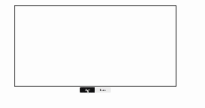
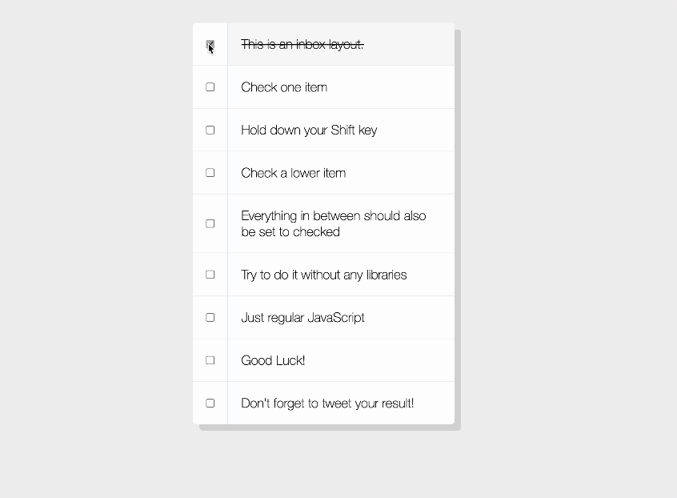

### Week 2...
## Day 8: Getting Artsy with HTML5 Canvas🎨

Today's journey was all about getting hands-on with the HTML5 Canvas element. It was a simple yet eye-opening experience. Here's what I found:

💡 The HTML **`<canvas></canvas>`** tag: This little tag lets us draw graphics right onto a web page using JavaScript.

💡 The **`HTMLCanvasElement.getContext()`** method: This handy method gives us access to a canvas's drawing context, unleashing several possibilities for enhancing visuals. One cool trick it offers is the **globalCompositeOperation property**, which lets us play with blending modes for some extra flair.

🌟 As a bonus challenge, I added an eraser function for my canvas!

## Day 9: Discovering 14 Handy Dev Tools Tricks 🖥️

Today's focus was on mastering some useful console instance methods. Here are a few that caught my attention:

⭐ [console.assert()](https://developer.mozilla.org/en-US/docs/Web/API/console/assert_static)

⭐ [console.group()](https://developer.mozilla.org/en-US/docs/Web/API/console/group_static)

⭐ [console.count()](https://developer.mozilla.org/en-US/docs/Web/API/console/group_static)

For those keen on delving deeper, more information can be found [here](https://developer.mozilla.org/en-US/docs/Web/API/console).

## Day 10: Implementing Hold Shift for Multiple Checkboxes ✅

Today's project involved implementing the functionality of holding down the Shift key to check multiple checkboxes. While it wasn't anything particularly groundbreaking, I've encountered a similar feature in my personal projects before. Nonetheless, delving into the logic behind this functionality was still intriguing and added to my understanding of web development

## Day 11: Custom HTML5 Video Player 🎥

Today's focus was on building a custom HTML5 video player. Although the user interface may appear simple with just a few buttons, each button serves a distinct purpose, such as play, skip, volume control, and more. I delved into understanding the logic behind these features, some of which were straightforward while others remained a bit fuzzy.

Additionally, I took the opportunity to dive a little deeper into WebKit. It's worth noting that every browser utilizes a layout engine to render HTML/CSS web pages, with WebKit being one such engine used by Safari and Chrome. The **`-webkit`** prefix on CSS selectors and properties is specific to this engine

🌟 As a bonus challenge, I successfully implemented a full-screen feature for the video player.

## Day 12: Exploring Key Sequence Detection (KONAMI CODE) 🔢

Today was a fun break from the usual implementations. I tinkered with the famous KONAMI CODE. If you're curious, check out the cornify.add() function—it's super cute 💖 

## Day 13: Slide In on Scroll

Today's challenge involved implementing the slide-in effect on the scroll. I won't lie—the math behind it had me feeling a bit dizzy 😵‍💫. However, I know that with more practice, I'll master it. Regardless, I'm excited to apply this scrolling technique to my future projects. The transitions are incredibly smooth and visually appealing!

## Day 14: Object and Array, Copy vs References

While not a new topic for me, today's focus on understanding the differences between copying and referencing objects and arrays was a great memory refresher 🧠

