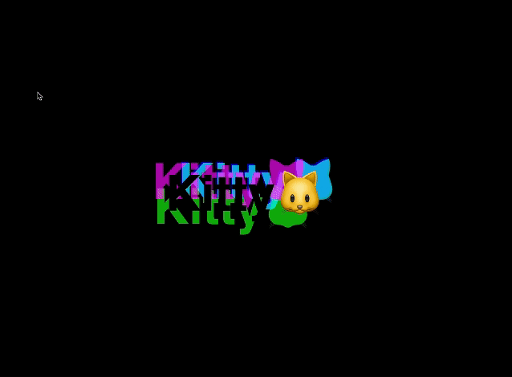
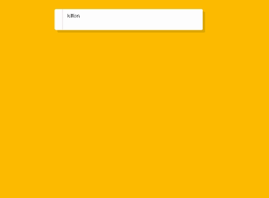
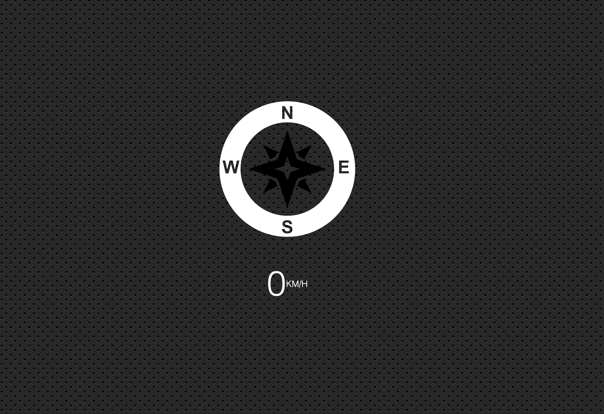
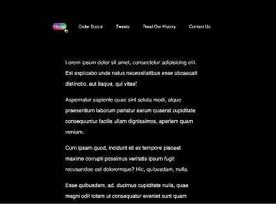

### Week 3
## Day15: LocalStorage and Event Delegation 📦

Today was all about refreshing my memory on how to set and retrieve data from localStorage. I also delved into the concept of event delegation, which proved to be quite enlightening. 🧠There's always something new to learn!

## Day16: CSS Text Shadow Mouse Move Effect** 🌈 🪄

Today's code was short but intense! Working with the offset value was quite challenging, but I'm determined to practice more and get the hang of it. Even though it was tough, I always loved diving into something new!

## Day17: Sorting names without articles 🔡 ✂️

Sorting names was a good refresher for me. I use sorting often, but I still need to peek at the documentation sometimes. Plus, I got to play around with regex, .replace(), and .trim() to remove articles from names.

## Day18: Tally String Times with Reduce 🕑🕖

This one made my head spin, especially since I'm not much of a math person. But I'm glad I gave it a shot! Besides the math stuff, I picked up some neat tricks with .map() and .reduce(). They're handy for wrangling lots of data.

## Day19: Unreal Webcam 🎥

The project presented significant challenges, introducing many new tools I hadn't encountered before. However, here's a summary of what I gained from the project:

⭐ Explored accessing webcam feeds using the navigator.mediaDevices.getUserMedia() method

⭐  Learned how to manipulate video streams with filters and effects using canvas

⭐  Developed skills in capturing images from the webcam

⭐ Integrated webcam functionalities into my web applications

⭐ Opened up possibilities for interactive and engaging user experiences in my projects

## Day20: Speech Recognition 🗣️

The project explored how to implement speech recognition directly in web applications using the browser's built-in functionality. I learned how to set up and configure speech recognition functionality, utilizing the SpeechRecognition API. This is so much fun 🤩 

‼ Note the accuracy is not 100%

## Day21: Geolocation-based Speedometer and Compass** 🧭

The lesson covered how to access the device's location information using the Geolocation API, enabling real-time tracking of the user's position and movement. It also explored how to calculate speed and display it on a speedometer. Additionally, I learned how to integrate a compass functionality.

## Day22: Follow Along Links** ✨ 🌈 📍

Today's project on Follow Along Links was enjoyable, although the offset value remains challenging for me. I discovered a new method, ".getBoundingClientRect()", which returns a DOMRect object providing information about the size of an element and its position relative to the viewport. This method proved to be quite useful, making the data easy to work with. Overall, it was a productive day of learning and experimenting with new techniques! 

