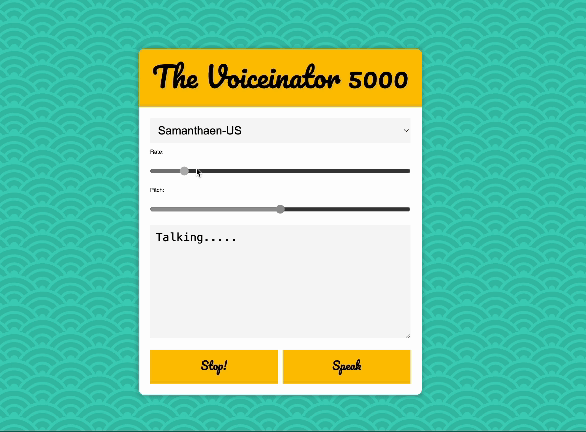
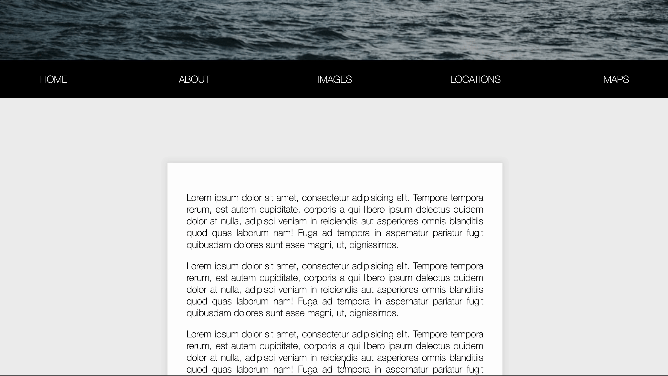
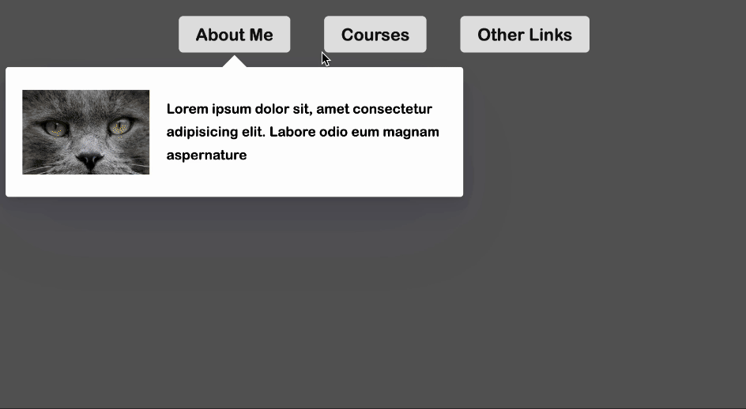
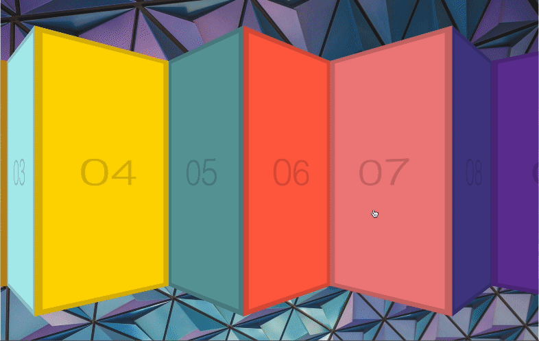
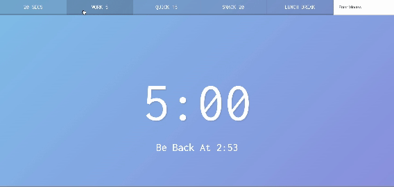
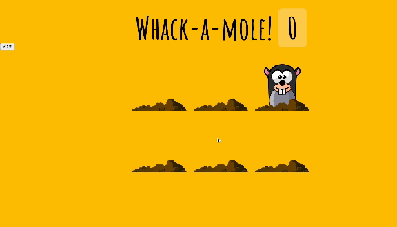

### Week 4

## Day23 Speech Synthesis 🗣️ ⏯️

 Today was all about voice! I had a blast learning new things. 

🌟 Explored the SpeechSynthesisUtterance web speech API, which controls the content to be read and various reading properties like language, pitch, and volume.

🌟 Created a UI interface to manipulate these API properties seamlessly.

🌟 Used built-in language options for the first time, adding more versatility to my projects.

🌟 Experimented with the .bind() method, which I'd come across before but never actually implemented.

## Day24 Sticky Nav👀

 In the "Sticky Nav" lesson, I learned how to create a navigation bar that sticks to the top of the screen as scrolling down a webpage.  Understanding the differences between sticky positioning and other methods like fixed or relative positioning was eye-opening. Additionally, figuring out how to smoothly transition the navigation bar between its regular and sticky states was quite rewarding.

## Day 25 Event Capture, Propagation, Bubbling and Once🫧

A memory refresh on event capturing and bubbling phases. Which describe the order in which events are triggered on nested elements. The lesson delved into event propagation, which refers to how events propagate through the DOM tree.  Including these 2 options:

🌟 ”once” : allows event listeners to be triggered only once and then automatically removed.

🌟 ”capture” :  the phase in which an event listener is triggered, in this phase, event travels from the root of the DOM to the target.

## Day 26 🔽 Stripe DropDown Menu

Today’s project is quite eye-opening!!

⭐ Explored how to create an interactive  dropdown menu/p>

⭐ Learned to implement smooth animations and transitions using CSS and JavaScript

⭐ Created a dropdown menu that expands and collapses gracefully as  users interact with it

Need time to master those techniques to create seamless animations and transitions though !!

## Day27 Click and Drag to scroll 🖱️ ⏬

In this project, I learned how to create a fluid and intuitive scrolling experience by allowing users to click on content and drag it to scroll. The tutorial covered concepts such as event handling, mouse interactions, and manipulating DOM elements to achieve this functionality.

## Day28 Video Speed Controller UI ⏩ ✨

Build a user interface that allows users to control the playback speed of videos dynamically. There was something similar we worked with in the previous project, so this is a great memory refresh! 

## Day 29 Countdown Timer ⏳

Got hands-on experience with the process of creating a dynamic and interactive timer that counts down from a specified duration. Delving deeper into JavaScript concepts such as date manipulation, event handling, and DOM manipulation to create a functional countdown timer.

## Day30 Whack a mole 👋🏻 🎮

A dynamic and interactive game. Although I have seen the game before, I never tried building it from scratch! I didn't only learn JavaScript concepts  but also a simple game logic, how cool ✨

I discovered something new today:

🌟  “isTrusted” property  which to confirm that the event was generated by a user action

🌟 The recursion technique to prevent the same hole from being repeated.

